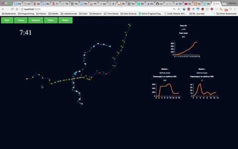
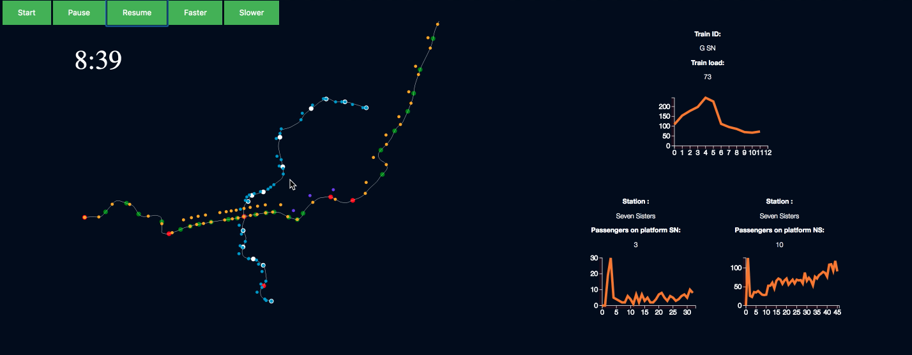

This is the repo for visualizing the simulation results of the following paper:

Predictive decision support platform and its application in crowding prediction and passenger information generation [Transportation Research Part-C]

